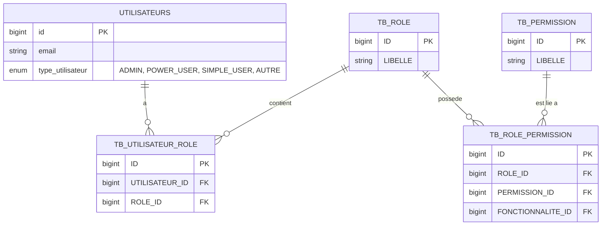

# Architecture de Sécurité - Rôles & Permissions

Cette documentation décrit le modèle d'autorisation et de gestion des accès (rôles et permissions) au sein du système ASTEasy API.

---

## 1. Modèle d'Autorisation Hybride

Le système combine deux approches complémentaires pour la gestion et la vérification des accès :

1. **Rôles et Permissions Granulaires (RBAC - Role-Based Access Control)** :
   * Les utilisateurs sont associés à des **Rôles** (`TB_ROLE`) via la table pivot `TB_UTILISATEUR_ROLE`.
   * Les Rôles sont associés à des **Permissions** (`TB_PERMISSION`) via la table pivot `TB_ROLE_PERMISSION`.
   * Les permissions peuvent être d'ordre général (ex: `VIEW_DASHBOARD`, `VIEW_REPORTS`) ou associées à une action sur une ressource spécifique au format `<ressource>.<action>` (ex: `formation.create`, `base.view`, `avancement.delete`).

2. **Types d'Utilisateurs Globaux (Niveaux de Privilèges)** :
   L'attribut `type_utilisateur` sur la table `utilisateurs` définit un niveau de privilège global :
   * **`ADMIN`** : Administrateur système. Accès complet en écriture/lecture. C'est le seul profil autorisé à configurer le système de sécurité (créer des rôles, lier des permissions, gérer les affectations).
   * **`POWER_USER`** : Utilisateur métier avancé. Autorisé à lire et modifier les données métiers (bases, avancements, formations, etc.) mais n'a pas accès à la sécurité globale.
   * **`SIMPLE_USER`** : Utilisateur standard. Accès en lecture seule aux données de l'API. Les modifications lui sont interdites (HTTP 403).
   * **`AUTRE`** : Rôle interne/spécifique.

---

## 2. Structure de la Base de Données

Le schéma ci-dessous illustre la structure physique des tables de sécurité :



* **`utilisateurs`** : Stocke l'identité de l'utilisateur et son type de compte.
* **`TB_ROLE`** : Rôles disponibles.
* **`TB_PERMISSION`** : Droits unitaires.
* **`TB_UTILISATEUR_ROLE`** : Table de liaison N:N utilisateur <-> rôles.
* **`TB_ROLE_PERMISSION`** : Table de liaison N:N rôles <-> permissions.

---

## 3. Résolution Dynamique des Droits (Laravel Gates & Policies)

Le cycle de validation d'un accès lors d'une requête HTTP s'effectue en deux étapes :

### Étape 1 : Interception Dynamique (`Gate::before`)
Avant d'exécuter la policy du modèle, le système tente de résoudre dynamiquement la permission requise via `AuthServiceProvider` :
1. Le système génère un libellé de permission à partir de l'action demandée et du modèle cible (ex: l'action `create` sur le modèle `Avancement` génère la permission `avancement.create`).
2. Le système vérifie si l'utilisateur possède cette permission via l'un de ses rôles (`$user->hasPermission(...)`).
3. **Si la permission est présente** : L'accès est **immédiatement autorisé** (court-circuitant la policy classique).

### Étape 2 : Fallback sur les Laravel Policies
Si aucune permission dynamique correspondante n'est trouvée pour l'utilisateur, l'autorisation se rabat sur la Policy associée au modèle (ex: `BasesPolicy`, `AvancementsPolicy`) :
* **Lecture (`viewAny`, `view`)** : Autorisé pour tout utilisateur authentifié.
* **Écriture (`create`, `update`, `delete`)** : Autorisé si le `type_utilisateur` est `ADMIN` ou `POWER_USER`.

---

## 4. Rôles et Permissions par Défaut (Seeder)

Lors de l'initialisation du système (`RolesPermissionsSeeder`), les rôles de base sont dotés des privilèges suivants :

| Rôle | Permissions par défaut | Type d'accès / Usage |
| :--- | :--- | :--- |
| **`ADMIN_FER`** | `VIEW_DASHBOARD`, `VIEW_REPORTS`, `MANAGE_USERS`, `MANAGE_ROLES`, `MANAGE_PERMISSIONS`, `MANAGE_BANKS`, `MANAGE_FINANCES`, `VIEW_AUDIT_LOGS` | Super-administrateur de l'application. |
| **`DCG_FER`** / **`DAF_FER`** | `VIEW_DASHBOARD`, `VIEW_REPORTS`, `MANAGE_BANKS`, `MANAGE_FINANCES` | Gestion financière, comptabilité et visualisation des tableaux de bord. |
| **`DT_FER`** / **`DG_FER`** | `VIEW_DASHBOARD`, `VIEW_REPORTS` | Visualisation et consultation des indicateurs/rapports. |
| **`AUDIT_FER`** | `VIEW_DASHBOARD`, `VIEW_REPORTS`, `VIEW_AUDIT_LOGS` | Audit de l'application et accès à l'historique des traces d'activité. |

---

## 5. Protection au Niveau des Routes

Certaines routes spécifiques et endpoints de contrôleurs sont directement protégés en amont par le middleware `CheckPermission` :
```php
Route::middleware('check_permission:VIEW_REPORTS|MANAGE_USERS')->...
```
Ce middleware intercepte la requête, vérifie si l'utilisateur possède l'une de ces permissions via ses rôles, et renvoie un code `403 Forbidden` si aucune permission n'est satisfaite.
